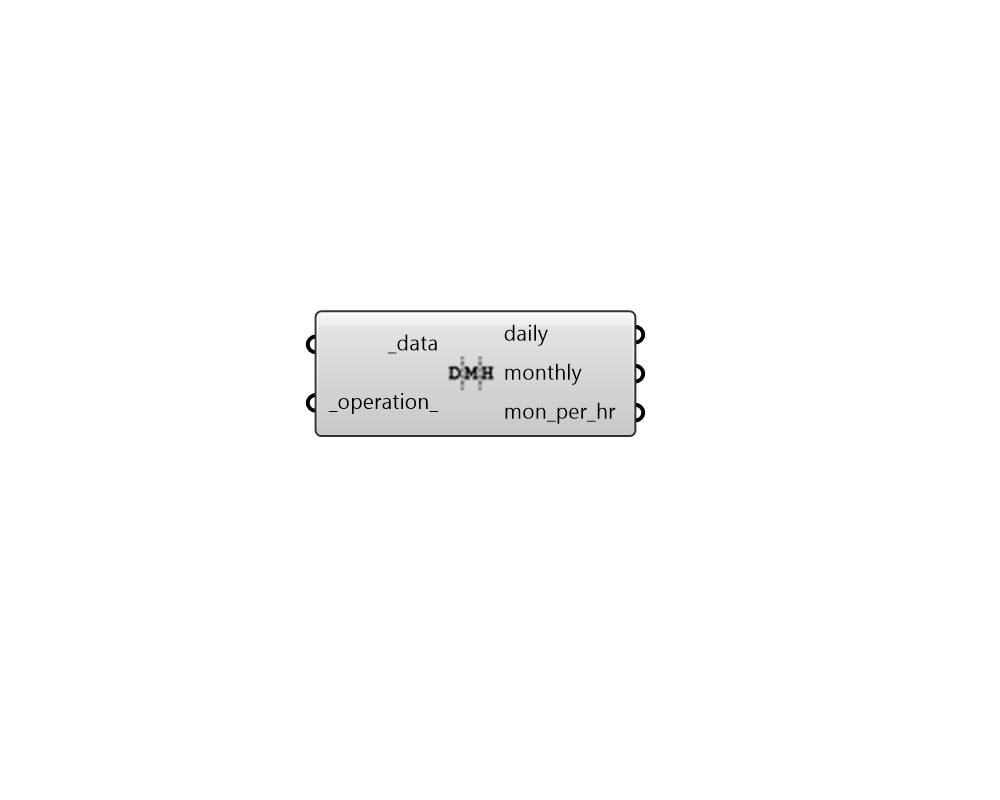

## Time Interval Operation

 - [[source code]](https://github.com/ladybug-tools/ladybug-grasshopper/blob/master/ladybug_grasshopper/src//LB%20Time%20Interval%20Operation.py)

Perform time interval operations on an hourly data collection. 

This includes operations like: - Average - Total - Percentile 

These actions can be performed over the following time intervals: - Daily - Monthly - Monthly per Hour 

#### Inputs
* ##### data [Required]
A Ladybug data collection object. 
* ##### operation 
Text indicating the operation that should be performed on the input hourly data. 
Such text must be one of the following: 

    - average

    - total

    - [a number between 0 and 100]
In the case of the last option, the number will be interpreted as a percentile of the data over the time period. For example, inputting 75 will return the 75th percentile value of each day/month/hour, inputting 0 will give the minimum value of each day/month/hour and inputting 100 will give the max value of each day/month/hour. 
Default is 'average' if the input data type is not cumulative and 'total' if the data type is not cumulative. 

#### Outputs
* ##### daily
Daily data collection derived from the input _data and _operation_. 
* ##### monthly
Monthly data collection derived from the input _data and _operation_. 
* ##### mon_per_hr
Monthly Per Hour data collection derived from the input _data and _operation_. 