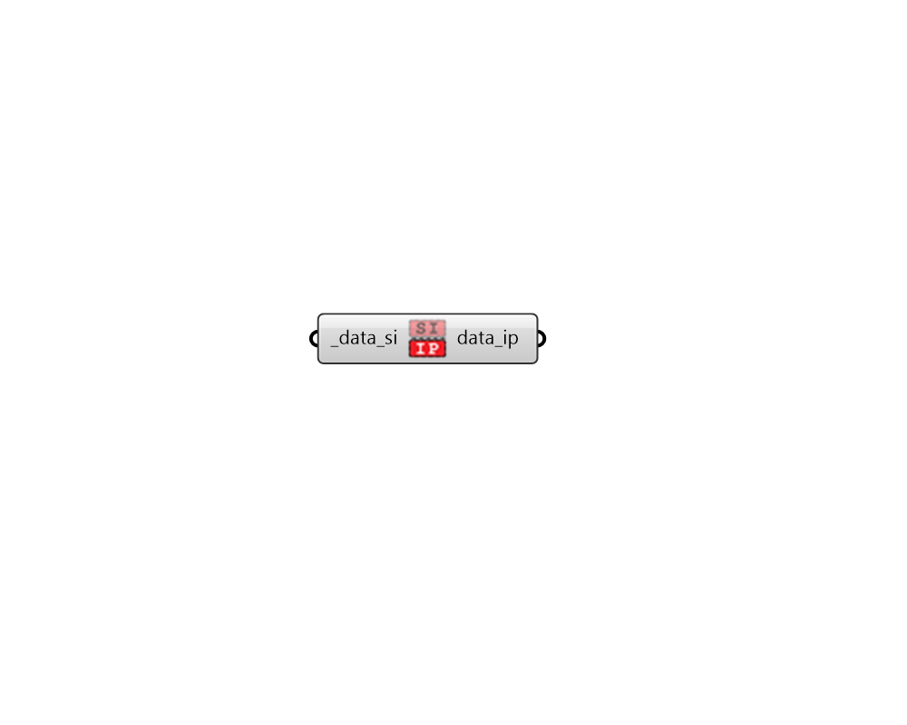

## To IP

 - [[source code]](https://github.com/ladybug-tools/ladybug-grasshopper/blob/master/ladybug_grasshopper/src//LB%20To%20IP.py)

Convert a DataCollection to IP values. 

#### Inputs
* ##### data_si [Required]
A DataCollection in SI units. 

#### Outputs
* ##### data_ip
The DataCollection in IP units. 