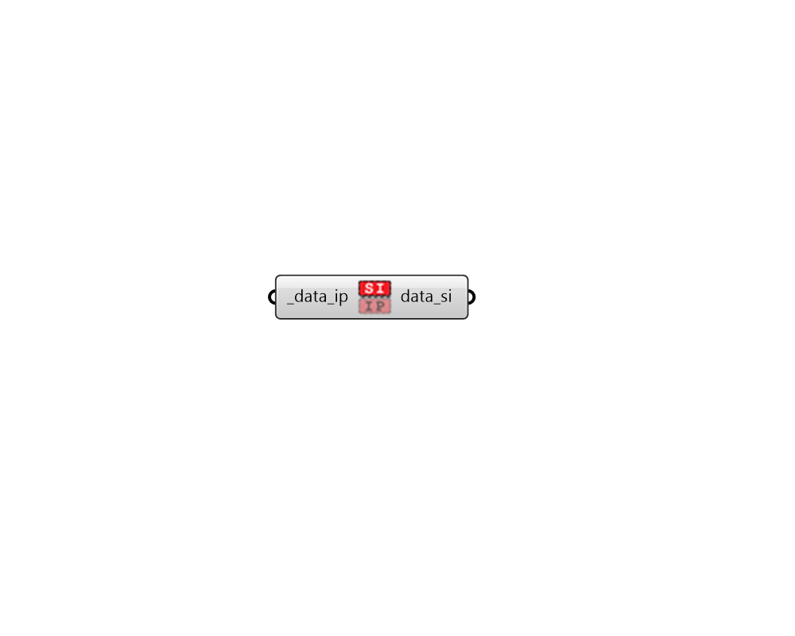

## To SI

 - [[source code]](https://github.com/ladybug-tools/ladybug-grasshopper/blob/master/ladybug_grasshopper/src//LB%20To%20SI.py)

Convert a DataCollection to SI values. 

#### Inputs
* ##### data_ip [Required]
A DataCollection in IP (or other) units. 

#### Outputs
* ##### data_si
The DataCollection in SI units. 