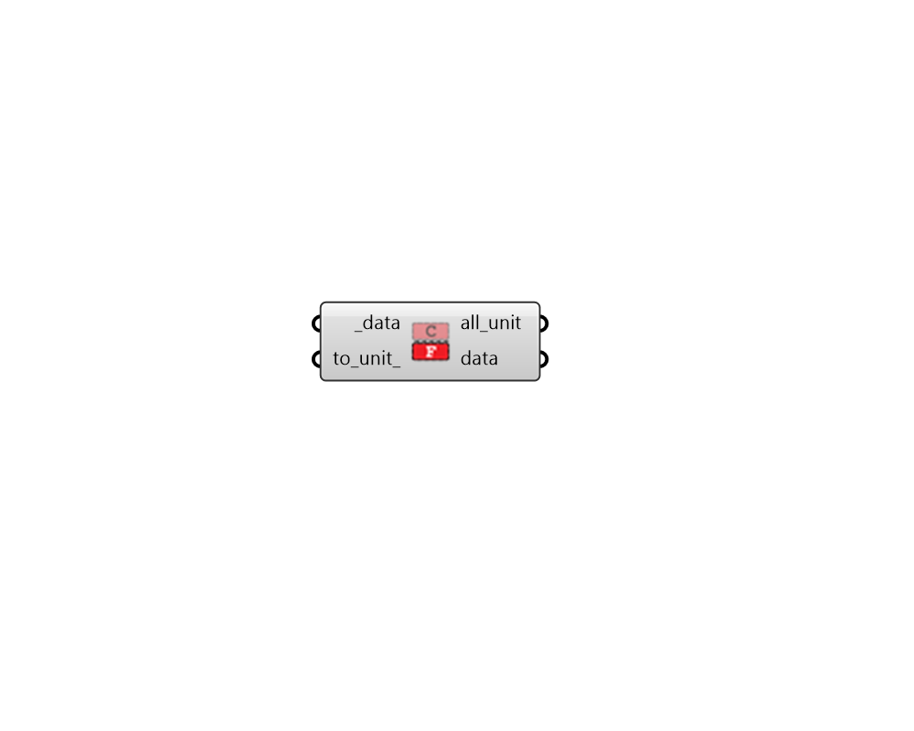

## To Unit

 - [[source code]](https://github.com/ladybug-tools/ladybug-grasshopper/blob/master/ladybug_grasshopper/src//LB%20To%20Unit.py)

Convert a DataCollection to the input _to_unit. 

#### Inputs
* ##### data [Required]
A DataCollection to be converted to different units. 
* ##### to_unit 
Text representing the unit to convert the DataCollection to (eg. m2). Connect the _data and see the all_unit output for a list of all currently-supported units for a given collection. The default won't perform any unit conversion on the output data. 

#### Outputs
* ##### all_unit
A list of all possible units that the input _data can be converted to. 
* ##### data
The converted DataCollection. 