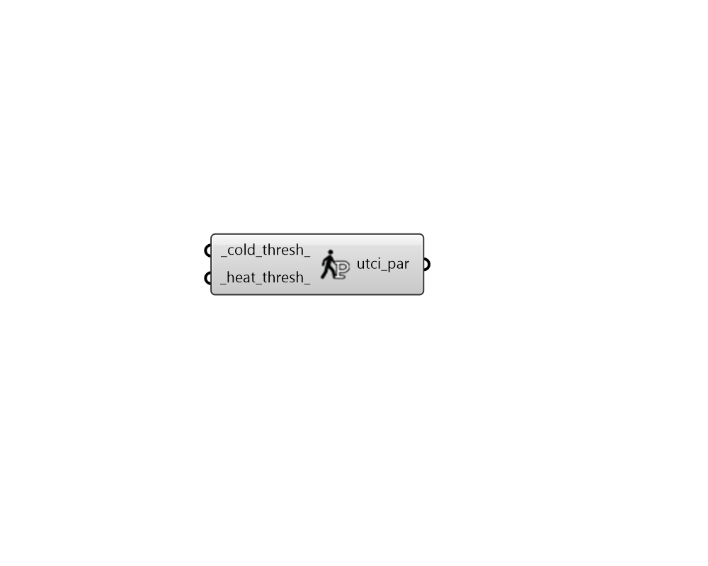
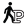

## UTCI Comfort Parameters

 - [[source code]](https://github.com/ladybug-tools/ladybug-grasshopper/blob/master/ladybug_grasshopper/src//LB%20UTCI%20Comfort%20Parameters.py)

Create a set of parameters that define the acceptable conditions of the Universal Thermal Climate Index (UTCI) comfort model. 

These parameters can be plugged into any of the components that compute UTCI comfort. 

#### Inputs
* ##### cold_thresh 
Temperature in Celsius below which the UTCI represents cold stress. (Default: 9C). 
* ##### heat_thresh 
A number between 0 and 1 indicating the upper limit of humidity ratio that is considered acceptable. Default is 1 for essentially no limit. 

#### Outputs
* ##### utci_par
A UTCI comfort parameter object that can be plugged into any of the components that compute UTCI thermal comfort. 