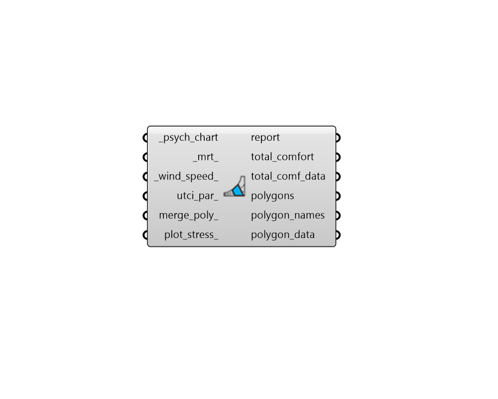

## UTCI Polygon

 - [[source code]](https://github.com/ladybug-tools/ladybug-grasshopper/blob/master/ladybug_grasshopper/src//LB%20UTCI%20Polygon.py)

Draw thermal comfort polygons on a Psychrometric Chart using the UTCI outdoor thermal comfort model. 

#### Inputs
* ##### psych_chart [Required]
A hourly, daily, or sub-hourly data collection of temperature values or a single temperature value in Celcius to be used for the whole analysis. If this input data collection is in in Farenheit, the entire chart will be drawn using IP units. Operative temperature should be used if it is available. Otherwise, air temperature (aka. dry bulb temperature) is suitable. 
* ##### mrt 
A number or list of numbers for the mean radiant temperature. These should be in Celsius if the Psychrometric Chart is in SI and Farenheit if the Psychrometric Chart is in IP. If None, a polygon for operative temperature will be plot, assuming that radiant temperature and air temperature are the same. (Default: None). 
* ##### wind_speed 
A number or list of numbers for for the meteorological wind speed values in m/s (measured 10 m above the ground). If None, this will default to a low wind speed of 0.5 m/s, which is the lowest input speed that is recommended for the UTCI model. 
* ##### utci_par 
Optional UTCIParameter object to specify parameters under which conditions are considered acceptable. If None, default will assume comfort thresholds consistent with those used by meteorologists to categorize outdoor conditions. 
* ##### merge_poly 
Boolean to note whether all comfort polygons should be merged into a single polygon instead of separate polygons for each set of input conditions. (Default: False). 
* ##### plot_stress 
Boolean to note whether polygons for heat/cold stress should be plotted in the output. This will include 3 polygons on either side of the comfort polygon(s) for... 

    * Moderate Stress

    * Strong Stress

    * Very Strong Stress

#### Outputs
* ##### report
... 
* ##### total_comfort
The percent of the data on the psychrometric chart that are inside all comfort polygons. 
* ##### total_comf_data
Data collection or a 0/1 value noting whether each of the data points on the psychrometric chart lies inside of a comfort polygon. 
This can be connected to the "LB Create Legend" component to generate a list of colors that can be used to color the points output from "LB Psychrometric Chart" component to see exactly which points are comfortable and which are not. 
Values are one of the following: 0 = uncomfortable 1 = comfortable 
* ##### polygons
A list of Breps representing the range of comfort (or heat/cold stress) for the input mrt and air speed. 
* ##### polygon_names
A list of names for each of the polygons which correspond with the polygons output above. This will include both the comfort polygons and the cold/heat stress polygons. 
* ##### polygon_data
A list of data collections or 0/1 values indicating whether each  of the data points on the psychrometric chart lies inside each of the comfort polygons. Each data collection or here corresponds to the names in the polygon_names output above. 
Values are one of the following: 0 = outside 1 = inside 