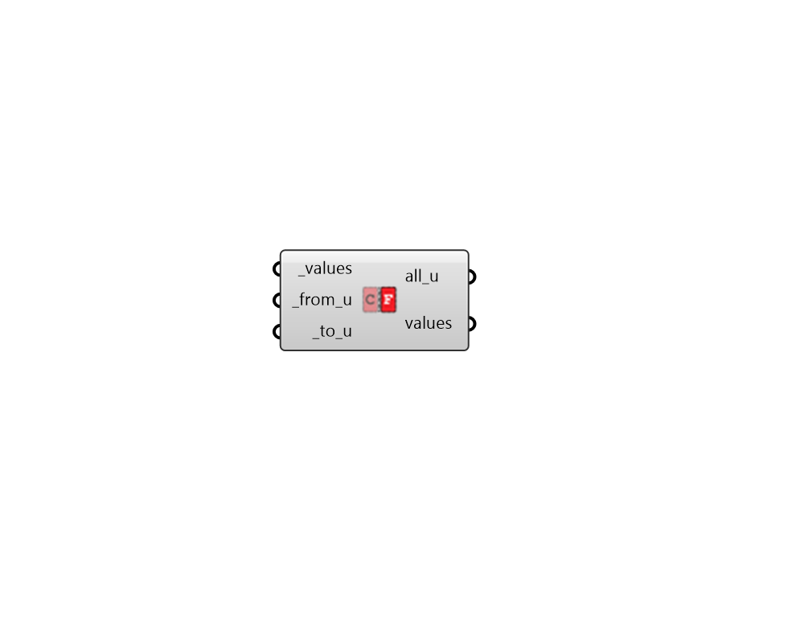

## Unit Converter
 - [[source code]](https://github.com/ladybug-tools/ladybug-grasshopper/blob/master/ladybug_grasshopper/src//LB%20Unit%20Converter.py)

Convert a value or list of values from one unit to another.
 

#### Inputs
* ##### values [Required]
Values to be converted from one unit type to another. 
* ##### from_u [Required]
Text indicating the units of the input _values (eg. 'C') 
* ##### to_u [Required]
Text indicating the units of the output values (eg. 'K') 

#### Outputs
* ##### all_u
A text string indicating all possible units that can be plugged into _from_u and _to_u. 
* ##### values
The converted numerical values. 