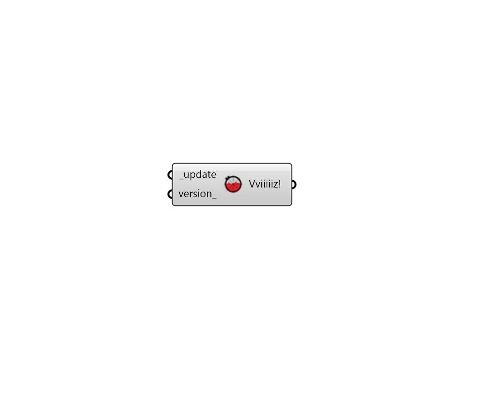

# Versioner

 - [\[source code\]](https://github.com/ladybug-tools/ladybug-grasshopper/blob/master/ladybug\_grasshopper/src/LB%20Versioner.py)

This component updates the Ladybug Tools core libraries and grasshopper components to either the latest development version available (default) or to a specific version of the grasshopper plugin.

The input version\_ does not need to be newer than the current installation and can be older but grasshopper plugin versions less than 0.3.0 are not supported. A list of all versions of the Grasshopper plugin and corresponding release notes can be found at: https://github.com/ladybug-tools/lbt-grasshopper/releases

### Inputs

* **update \[Required]**

Set to True to update your installation of Ladybug Tools to the latest development version or to be at the version specified below.

* **version**

An optional text string for the version of the grasshopper plugin which you would like to update to. The input should contain only integers separated by two periods (eg. 1.0.0). The version does not need to be newer than the current installation and can be older but grasshopper plugin versions less than 0.3.0 are not supported. A list of all versions of the Grasshopper plugin can be found here - https://github.com/ladybug-tools/lbt-grasshopper/releases

### Outputs

* **Vviiiiiz!**

!!!
