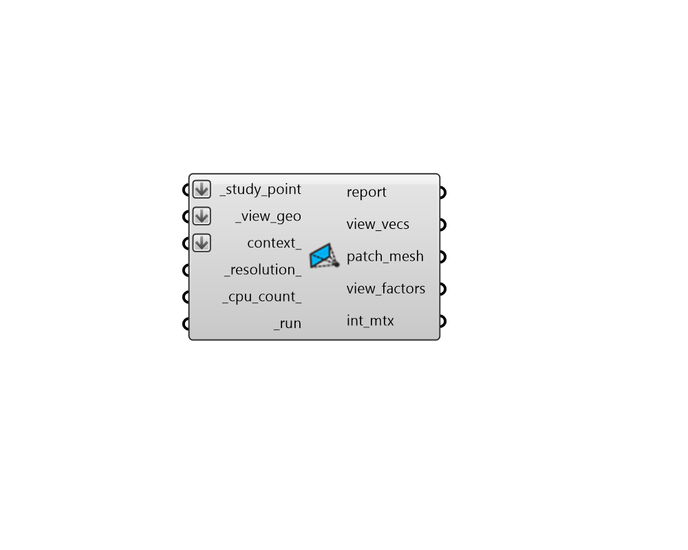

## View Factors

 - [[source code]](https://github.com/ladybug-tools/ladybug-grasshopper/blob/master/ladybug_grasshopper/src//LB%20View%20Factors.py)

Calculate view factors from a point or plane to a set of geometries. 

View factors are used in many thermal comfort calculations such as mean radiant temperture (MRT) or discomfort from radiant assymetry.  

#### Inputs
* ##### study_point [Required]
A point or plane from which view vectors will be projected. Note that, if a point is connected, all view vectors will be weighted evenly (assuming no directional bias). However, if a plane is connected, vectors will be weighted based on their angle to the plane normal, producing view factors for a surface in the connected plane. The first is useful for MRT calculations while the latter is needed for radiant assymetry calculations. This input can also be a list of several points or planes. 
* ##### view_geo [Required]
A list of breps, surfaces, or meshes to which you want to compute view factors. Note that by meshing and joining several goemtries together, the combined view factor to these geometries can be computed. 
* ##### context 
Optional context geometry as breps, surfaces, or meshes that can block the view to the _view_geo. 
* ##### resolution 
A positive integer for the number of times that the original view vectors are subdivided. 1 indicates that 145 evenly-spaced vectors are used to describe a hemisphere, 2 indicates that 577 vectors describe a hemisphere, and each successive value will roughly quadruple the number of view vectors used. Setting this to a high value will result in a more accurate analysis but will take longer to run. (Default: 1). 
* ##### cpu_count 
An integer to set the number of CPUs used in the execution of the intersection calculation. If unspecified, it will automatically default to one less than the number of CPUs currently available on the machine or 1 if only one processor is available. 
* ##### run [Required]
Set to True to run the component and claculate view factors. 

#### Outputs
* ##### report
... 
* ##### view_vecs
A list of vectors which are projected from each of the points to evaluate view. 
* ##### patch_mesh
A mesh that represents the sphere of view patches around the _study_point at the input _resolution_. There is one face per patch and this can be used along with the int_mtx to create a colored visualization of patches corresponding to different geometries around the point. Specifically, the "LB Spaital Heatmap" component is recommended for such visualizations. Note that only one sphere is ever output from here and, in the event that several _study_points are connected, this sphere will be located at the first point. Therefore, to create visualizations for the other points, this mesh should be moved using the difference between the first study point and following study points. 
* ##### view_factors
A list of view factors that describe the fraction of sperical view taken up by the input surfaces.  These values range from 0 (no view) to 1 (full view).  If multiple _study_points have been connected, this output will be a data tree with one list for each point. 
* ##### int_mtx
A Matrix object that can be connected to the "LB Deconstruct Matrix" component to obtain detailed vector-by-vector results of the study. Each sub-list (aka. branch of the Data Tree) represents one of the points used for analysis. Each value in this sub-list corresponds to a vector used in the study and the value denotes the index of the geometry that each view vector hit. This can be used to identify which view pathces are intersected by each geometry. If no geometry is intersected by a given vector, the value will be -1. 