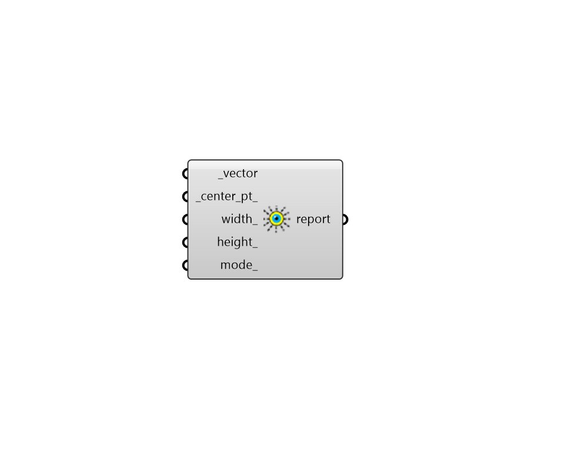

## View From Sun

 - [[source code]](https://github.com/ladybug-tools/ladybug-grasshopper/blob/master/ladybug_grasshopper/src//LB%20View%20From%20Sun.py)

Open a new viewport in Rhino that shows the parallel-projected view from the sun. 

This is useful for understanding what parts of Rhino geometry are shaded at a particular hour of the day. 

#### Inputs
* ##### vector [Required]
A sun vector from which the the Rhino view will be generated. Use the "LB SunPath" component to generate sun vectors. 
* ##### center_pt 
The target point of the camera for the Rhino view that will be generated.  This point should be close to the Rhino geometry that you are interested in viewing from the sun. If no point is provided, the Rhino origin will be used (0, 0, 0). 
* ##### width 
An optional interger for the width (in pixels) of the Rhino viewport that will be generated. 
* ##### height 
An optional interger for the height (in pixels) of the Rhino viewport that will be generated. 
* ##### mode 
An optional text input for the display mode of the Rhino viewport that will be generated. For example: Wireframe, Shaded, Rendered, etc. 

#### Outputs
* ##### report
The name of the viewport that was opened. 