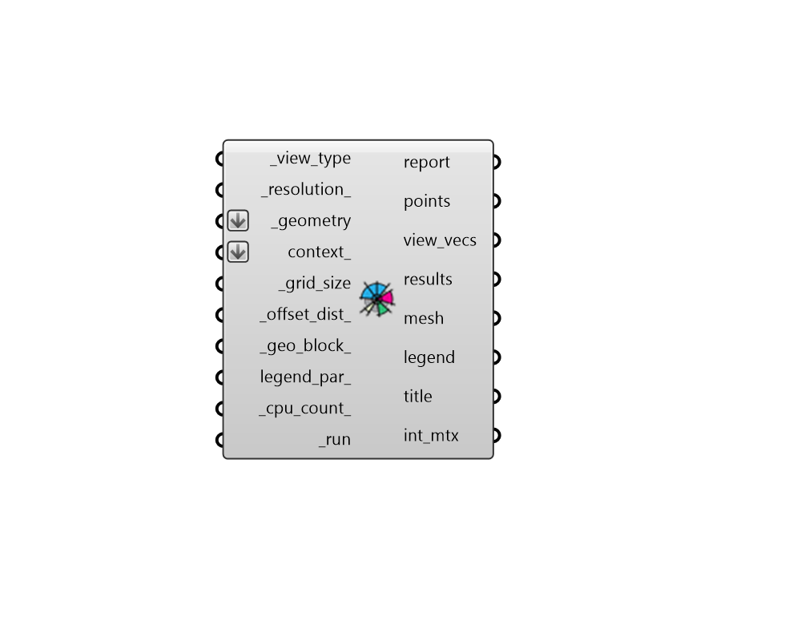

## View Percent

 - [[source code]](https://github.com/ladybug-tools/ladybug-grasshopper/blob/master/ladybug_grasshopper/src//LB%20View%20Percent.py)

Evaluate the percent view to the outdoors or sky from input geometry through context. 

Such view calculations can be used to estimate the quality of a view to the outdoors from a given location on the indoors. They can also be used on the outdoors to evaluate the openness of street canyons to the sky, which has implications for the pedestrian expereince as well as the rate of radiant heat loss from urban surfaces and the sky at night. 

Note that this component uses the CAD environment's ray intersection methods, which can be fast for geometries with low complexity but does not scale well for complex geometries or many test points. For such complex studies, honeybee-radiance should be used. 

#### Inputs
* ##### view_type [Required]
Text or an integer representing the type of view analysis to conduct.  Choose from the following options. 
0 - HorizontalRadial - The percentage of the 360 horizontal view plane that is not blocked by the context geometry. 
1 - Horizonta30DegreeOffset - The percentage of the 360 horizontal view band bounded on top and bottom by a 30 degree offset from the horizontal plane. 30 degress corresponds roughly to the vertical limit of human peripheral vision. 
2 - Spherical - The percentage of the sphere surrounding each of the test points that is not blocked by context geometry. This is equivalent to a solid angle and gives equal weight to all portions of the sphere. 
3 - SkyExposure - The percentage of the sky that is visible from each of the the test points. This is distinct from SkyView, which is the amount of sky seen by a surface. SkyExposure is equivalent to a solid angle and gives equal weight to all portions of the sky. 
4 - SkyView - The percentage of the sky that is visible from the _geometry surfaces. This is distinct from SkyExposure, which treats each part of the sky with equal weight. SkyView weights the portions of the sky according to thier projection into the plane of the surface being evaluated. So SkyView for a horizontal surface would give more importance to the sky patches that are overhead vs. those near the horizon. 
* ##### resolution 
A positive integer for the number of times that the original view vectors are subdivided. 1 indicates that 145 evenly-spaced vectors are used to describe a hemisphere, 2 indicates that 577 vectors describe a hemisphere, and each successive value will roughly quadruple the number of view vectors used. Setting this to a high value will result in a more accurate analysis but will take longer to run. (Default: 1). 
* ##### geometry [Required]
Rhino Breps and/or Rhino Meshes for which view analysis will be conducted. If Breps are input, they will be subdivided using the _grid_size to yeild individual points at which analysis will occur. If a Mesh is input, view analysis analysis will be performed for each face of this mesh instead of subdividing it. 
* ##### context 
Rhino Breps and/or Rhino Meshes representing context geometry that can block view from the test _geometry. 
* ##### grid_size [Required]
A positive number in Rhino model units for the size of grid cells at which the input _geometry will be subdivided for direct sun analysis. The smaller the grid size, the higher the resolution of the analysis and the longer the calculation will take.  So it is recommended that one start with a large value here and decrease the value as needed. However, the grid size should usually be smaller than the dimensions of the smallest piece of the _geometry and context_ in order to yield meaningful results. 
* ##### offset_dist 
A number for the distance to move points from the surfaces of the input _geometry.  Typically, this should be a small positive number to ensure points are not blocked by the mesh. (Default: 10 cm in the equivalent Rhino Model units). 
* ##### geo_block 
Set to "True" to count the input _geometry as opaque and set to "False" to discount the _geometry from the calculation and only look at context_ that blocks the view.  The default depends on the _view_type used. 
It is "True" for: 

    * SkyExposure

    * SkyView
It is "False" for: 

    * HorizontalRadial

    * Horizonta30DegreeOffset

    * Spherical
* ##### legend_par 
Optional legend parameters from the "LB Legend Parameters" that will be used to customize the display of the results. 
* ##### cpu_count 
An integer to set the number of CPUs used in the execution of the intersection calculation. If unspecified, it will automatically default to one less than the number of CPUs currently available on the machine or 1 if only one processor is available. 
* ##### run [Required]
Set to "True" to run the component and perform view analysis of the input _geometry. 

#### Outputs
* ##### report
... 
* ##### points
The grid of points on the test _geometry that are be used to perform the view analysis. 
* ##### view_vecs
A list of vectors which are projected from each of the points to evaluate view. 
* ##### results
A list of numbers that aligns with the points. Each number indicates the percentage of the view_vecs that are not blocked by context geometry. 
* ##### mesh
A colored mesh of the test _geometry representing the percentage of the input _geometry's view that is not blocked by context. 
* ##### legend
A legend showing the number of hours that correspond to the colors of the mesh. 
* ##### title
A text object for the study title. 
* ##### int_mtx
A Matrix object that can be connected to the "LB Deconstruct Matrix" component to obtain detailed vector-by-vector results of the study. Each sub-list (aka. branch of the Data Tree) represents one of the points used for analysis. The length of each sub-list matches the number of view_vecs used for the analysis. Each value in the sub-list is either a "1", indicating that the vector is visible for that vector, or a "0", indicating that the vector is not visible for that vector. 