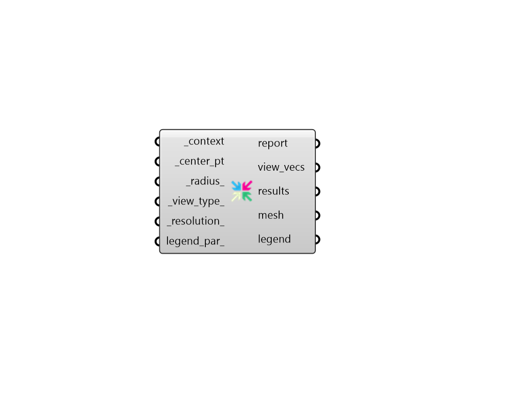

## View Rose

 - [[source code]](https://github.com/ladybug-tools/ladybug-grasshopper/blob/master/ladybug_grasshopper/src//LB%20View%20Rose.py)

Visualize the view openness around a given point as a colored mesh that fills a circle, sphere, or hemisphere (depending on the specified view type). 

The input context will block the view, resulting in a decresed view rose size and a change in the view rose color. 

#### Inputs
* ##### context [Required]
Rhino Breps or Meshes representing context geometry that can block the view around the center point. 
* ##### center_pt [Required]
A point for the center of the view rose from which view openness will be evaluated. 
* ##### radius 
A number for the radius of the view rose in Rhino model units. This is also used to evaluate the distance at which context is no longer able to block the view from the center point. This value should typically be increased if the view rose does not extend past the _context geometry. (Default: 100 meters in the current Rhino model units system). 
* ##### view_type 
Text or an integer representing the type of view analysis to conduct. Choose from the following options. (Default: 0 - HorizontalRadial) 
0 - HorizontalRadial - The percentage of the 360 horizontal view plane that is not blocked by the context geometry. 
1 - Horizontal30DegreeOffset - The percentage of the 360 horizontal view band bounded on top and bottom by a 30 degree offset from the horizontal plane. 30 degrees corresponds roughly to the vertical limit of human peripheral vision. 
2 - Spherical - The percentage of the sphere surrounding each of the test points that is not blocked by context geometry. This is equivalent to a solid angle and gives equal weight to all portions of the sphere. 
3 - SkyExposure - The percentage of the sky that is visible from each of the the test points. 
* ##### resolution 
A positive integer for the number of times that the original view vectors are subdivided. For a circle, 1 indicates that 72 evenly-spaced vectors are used to describe a circle, 2 indicates that 144 vectors describe a circle, and each successive value will roughly double the number of view vectors used. For a dome, 1 indicates that 1225 are used to describe the dome, 2 indicates that 5040 view vectors describe the some and each successive value will roughly quadruple the number of view vectors used. Setting this to a high value will result in a more accurate analysis but will take longer to run. (Default: 1). 
* ##### legend_par 
Optional legend parameters from the "LB Legend Parameters" that will be used to customize the display of the results. 

#### Outputs
* ##### report
... 
* ##### view_vecs
A list of vectors which are projected from each of the points to evaluate view. 
* ##### results
A list of numbers that aligns with the vertices of the mesh. Each number indicates the distance from the _center_pt at which the view is blocked from a particular direction. 
* ##### mesh
A colored mesh representing the visible area from the viewpoint past the _context geometry. Colors indicate how open the view is from a given direction. 
* ##### legend
A legend that correspond to the colors of the mesh and shows the distance at which vectors are blocked. 