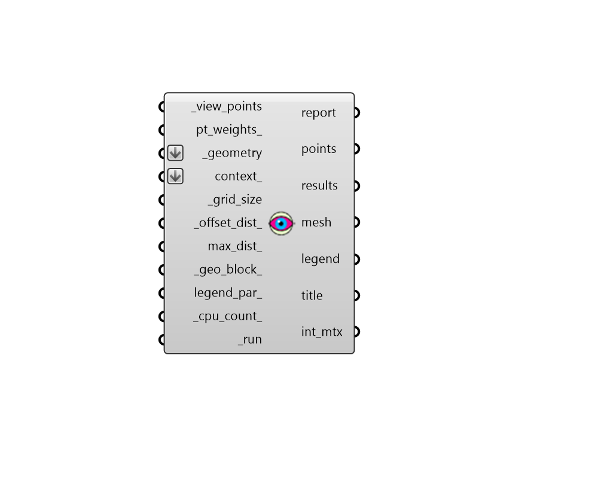

##  Visibility Percent - [[source code]](https://github.com/ladybug-tools/ladybug-grasshopper/blob/master/ladybug_grasshopper/src//LB%20Visibility%20Percent.py)

Evaluate the percent visibility from geometry to a specific set of points.
 

Such visibility calculations can be used to understand the portions of a building
 facade that can see a skyline or landmark when used on the outdoors. When used
 on the indoors, they can evaluate the spectator view of a stage, screen, or other
 point of interest.
 

#### Inputs
* ##### view_points [Required]
A list of points that characterize an area of interest to which
 visibility is being evaluated. If the area of interest is more like
 a surface than an individual point, the "LB Generate Point Grid"
 component can be used to obtain a list of points that are evenly
 distributed over the surface. 
* ##### pt_weights 
An optional list of numbers that align with the _view_points
 and represent weights of importance for each point.  Weighted
 values should be between 0 and 1 and should be closer to 1 if a
 certain point is more important. The default value for all points
 is 0, which means they all have an equal importance. 
* ##### geometry [Required]
Rhino Breps and/or Rhino Meshes for which visibility analysis
 will be conducted. If Breps are input, they will be subdivided using
 the _grid_size to yeild individual points at which analysis will
 occur. If a Mesh is input, visibility analysis analysis will be
 performed for each face of this mesh instead of subdividing it. 
* ##### context 
Rhino Breps and/or Rhino Meshes representing context geometry
 that can block visibility from the test _geometry. 
* ##### grid_size [Required]
A positive number in Rhino model units for the size of grid
 cells at which the input _geometry will be subdivided for direct sun
 analysis. The smaller the grid size, the higher the resolution of
 the analysis and the longer the calculation will take.  So it is
 recommended that one start with a large value here and decrease
 the value as needed. However, the grid size should usually be
 smaller than the dimensions of the smallest piece of the _geometry
 and context_ in order to yield meaningful results. 
* ##### offset_dist 
A number for the distance to move points from the surfaces
 of the input _geometry.  Typically, this should be a small positive
 number to ensure points are not blocked by the mesh. (Default: 10 cm
 in the equivalent Rhino Model units). 
* ##### max_dist 
An optional number to set the maximum distance beyond which the
 end_points are no longer considered visible by the start_points.
 If None, points with an unobstructed view to one another will be
 considered visible no matter how far they are from one another. 
* ##### geo_block 
Set to "True" to count the input _geometry as opaque and
 set to "False" to discount the _geometry from the calculation and
 only look at context_ that blocks the visibility. (Default: True) 
* ##### legend_par 
Optional legend parameters from the "LB Legend Parameters"
 that will be used to customize the display of the results. 
* ##### parallel 
Set to "True" to run the study using multiple CPUs. This can
 dramatically decrease calculation time but can interfere with
 other computational processes that might be running on your
 machine. (Default: False). 
* ##### run [Required]
Set to "True" to run the component and perform visibility analysis of
 the input _geometry. 

#### Outputs
* ##### report
...
* ##### points
The grid of points on the test _geometry that are be used to perform
 the visibility analysis.
* ##### results
A list of numbers that aligns with the points. Each number indicates
 the percentage of the _view_points that are not blocked by context geometry.
* ##### mesh
A colored mesh of the test _geometry representing the percentage of
 the input _geometry's visibility that is not blocked by context.
* ##### legend
A legend showing the number of hours that correspond to the colors
 of the mesh.
* ##### title
A text object for the study title.
* ##### int_mtx
A Matrix object that can be connected to the "LB Deconstruct Matrix"
 component to obtain detailed point-by-point results of the study.
 Each sub-list (aka. branch of the Data Tree) represents one of the
 geometry points used for analysis. The length of each sub-list matches
 the number of _view_points used for the analysis. Each value in the
 sub-list is either a "1", indicating that the vector is visible
 for that vector, or a "0", indicating that the vector is not visible
 for that vector.