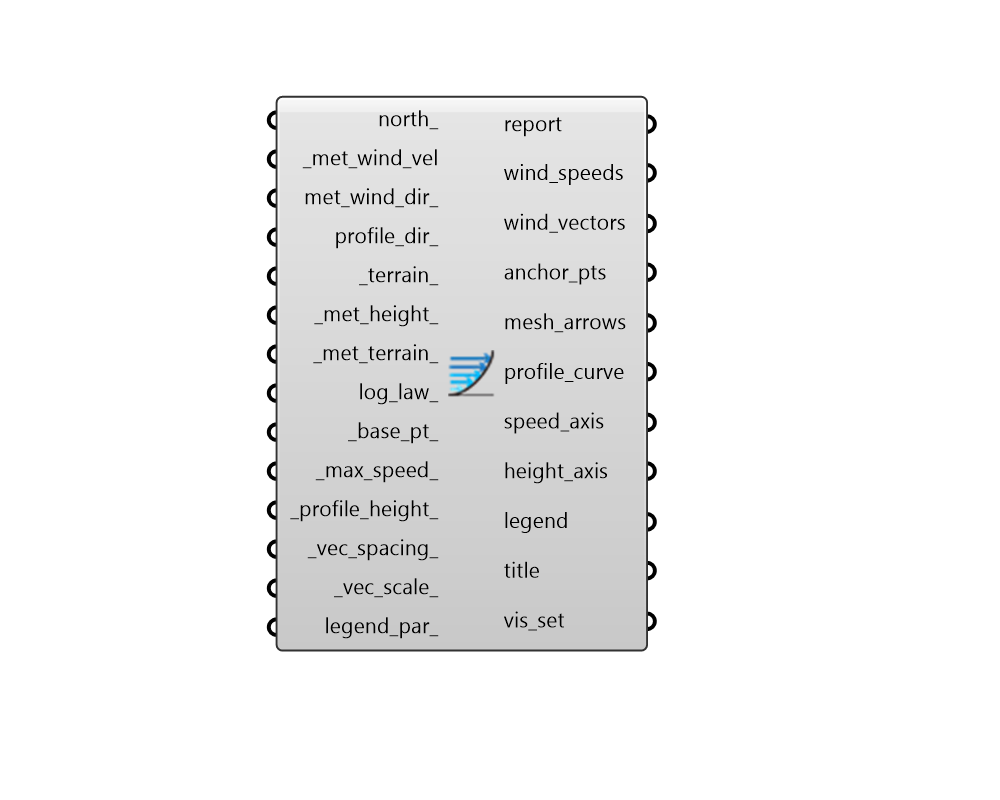

## Wind Profile

 - [[source code]](https://github.com/ladybug-tools/ladybug-grasshopper/blob/master/ladybug_grasshopper/src//LB%20Wind%20Profile.py)

Visualize a wind profile curve for a given terrain type. 

Wind profiles assist with understanding how wind speed decreases as one approaches the ground or increases as one leaves the ground.  

By default, the wind profile output by this component will be an average over the _met_wind_vel data collection (or it can be for a single meteorological wind velocity for point-in-time studies). 

If a met_wind_dir_ data collection is connected, the wind profile will point in the direction of prevailing wind direction by default. A profile_dir_ can then be connected to understand the average wind profile from a specific cardinal direction (eg. NE). 

#### Inputs
* ##### north 
A number between -360 and 360 for the counterclockwise difference between the North and the positive Y-axis in degrees. 90 is West and 270 is East. This can also be Vector for the direction to North. (Default: 0) 
* ##### met_wind_vel [Required]
A data collection of meteorological wind speed measured at the _met_height_ with the _met_terrian [m/s]. Typically, this comes from the "LB Import EPW" component. This can also be a single number for the meteorological wind speed in m/s. 
* ##### met_wind_dir 
An optional number between 0 and 360 representing the degrees from north that the meteorological wind is blowing. 0 = North, 90 = East, 180 = South, 270 = West. This can also a data collection of meteorological wind directions. in which case the wind profile will be oriented towards the prevailing wind (unless a profile_dir_ is connected). When unspecified, the wind profile is simply drawn in the XY plane. 
* ##### profile_dir 
An optional text string representing the cardinal direction that the wind profile represents. This input only has an effect when a data collection is connected for met_wind_dir_. It will be used to draw a wind profile for only the hours of the data collection where the wind is blowing in the specified direction. This can also be an integer that codes for a particular orientation. Choose from the following. 
0 = N 1 = NE 2 = E 3 = SE 4 = S 5 = SW 6 = W 7 = NW 
* ##### terrain 
Text string that sets the terrain class associated with the wind profile. This can also be an integer that codes for the terrain. (Default: city). Must be one the following. 
0 = city - 50% of buildings above 21m over a distance of at least 2000m upwind. 1 = suburban - suburbs, wooded areas. 2 = country - open, with scattered objects generally less than 10m high. 3 = water - flat areas downwind of a large water body (max 500m inland). 
* ##### met_height 
A number for the height above the ground at which the meteorological wind speed is measured in meters. (Default: 10 meters, which is the standard used by most airports and EPW files). 
* ##### met_terrain 
Text string that sets the terrain class associated with the meteorological wind speed. This can also be an integer that codes for the terrain. (Default: country, which is typical of most airports where wind measurements are taken). Must be one the following. 
0 = city - 50% of buildings above 21m over a distance of at least 2000m upwind. 1 = suburban - suburbs, wooded areas. 2 = country - open, with scattered objects generally less than 10m high. 3 = water - flat areas downwind of a large water body (max 500m inland). 
* ##### log_law 
A boolean to note whether the wind profile should use a logarithmic law to determine wind speeds instead of the default power law, which is used by EnergyPlus. (Default: False). 
* ##### base_pt 
A point that sets the ground level frm which the wind profile is drawn. By default, the profile is generated at the scene origin. 
* ##### max_speed 
Script variable WindProfile 
* ##### profile_height 
A number in meters to specify the maximum height of the wind profile. (Default: 30 meters). 
* ##### vec_spacing 
A number in meters to specify the difference in height between each of the mesh arrows. (Default 2 meters). 
* ##### vec_scale 
A number to denote the length dimension of a 1 m/s wind vector in meters. This can be used to change the scale of the wind vector meshes in relation to the height of the wind profile curve. (Default: 5 meters). 
* ##### legend_par 
An optional LegendParameter object to change the display of the wind profile. 

#### Outputs
* ##### report
Reports, errors, warnings, etc. 
* ##### wind_speeds
A list of wind speeds in [m/s] that correspond to the wind vectors slong the height of the wind profile visualization. 
* ##### wind_vectors
A list of vectors that built the profile. Note that the magnitude of these vectors is scaled based on the _vec_scale_ input and a _vec_scale_ of 1 will make the magnitude of the vector equal to the wind speed in [m/s]. 
* ##### anchor_pts
A list of anchor points for each of the vectors above, which correspond to the height above the ground for each of the vectors. 
* ##### mesh_arrows
A list of colored mesh objects that represent the wind speeds along the height of the wind profile. 
* ##### profile_curve
A curve outlining the wind speed as it changes with height. 
* ##### speed_axis
A list of line segments and text objects that mark the X axis, which relates to the wind speed in (m/s). 
* ##### height_axis
A list of line segments and text objects that mark the Y axis, which relates to the the height above the ground in Rhino model units. 
* ##### legend
A legend for the colored mesh_arrows, which notes their speed. 
* ##### title
A text object for the global_title. 
* ##### vis_set
An object containing VisualizationSet arguments for drawing a detailed version of the Wind Profile in the Rhino scene. This can be connected to the "LB Preview Visualization Set" component to display this version of the Wind Profile in Rhino. 