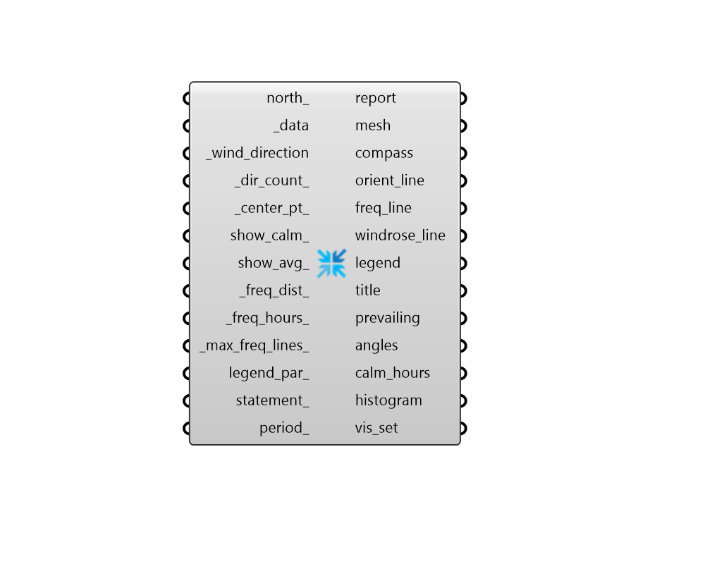

## Wind Rose
 - [[source code]](https://github.com/ladybug-tools/ladybug-grasshopper/blob/master/ladybug_grasshopper/src//LB%20Wind%20Rose.py)

Create a plot of any hourly data by wind directions.
 

#### Inputs
* ##### north 
An optional number between -360 and 360 for the counterclockwise difference between the North and the positive Y-axis in degrees. 90 is West and 270 is East. This can also be Vector for the direction to North 
* ##### data [Required]
A HourlyContinuousCollection or HourlyDiscontinuousCollection of values corresponding to the wind directions, which is "binned" by the direction intervals. This input usually consists of wind speed values, but is not limited to this data type. It can also be a list of data collections in which case multiple wind roses will be output. 
* ##### wind_direction [Required]
A HourlyContinuousCollection or HourlyDiscontinuousCollection of wind directions which will be used to "bin" the _data items for the windrose. 
* ##### dir_count 
Number that determines the number of directions to the wind rose will display. The number of directions must be greater then three to plot the wind rose (Default: 36). 
* ##### center_pt 
Point3D to be used as a starting point to generate the geometry of the plot (Default: (0, 0, 0)). 
* ##### show_calmrose 
A boolean to indicate if the wind rose displays a calm rose. The calm rose is a radial plot in the center of the wind rose with a radius corresponding to the total zero values divided by the number of directions. This allows the wind rose to represent zero values from _data even though such values don't have any direction associated with them. (Default: False). 
* ##### show_freq 
A boolean to show the frequency of _data data values in the wind direction bins. The frequency lines represent constant intervals in time while the color illustrates the average _data data values associated with each interval. The number of frequency lines with similar colors therefore indicate a higher frequency of that value. (Default: True) 
* ##### freq_dist 
The distance for the frequency interval in model units. If  _show_calmrose is True, then the initial frequency interval corresponds to the number of calm hours in the data collection, which may not align with this _freq_dist (Default: 5 meters) 
* ##### freq_hours 
The number of hours in each frequency interval (Default: 50). 
* ##### max_freq_lines 
A number representing the maximum frequency intervals in the rose, which determines the maximum amount of hours represented by the outermost ring of the windrose. Specifically, this number multiplied by the _freq_hours_ parameter will equal the maximum hours in that outermost ring. By default, this value is determined by the wind direction with the largest number of hours (the highest frequency) but you may want to change this if you have several wind roses that you want to compare to each other. For example, if you have wind roses for different months or seasons, which each have different maximum frequencies. 
* ##### legend_par 
An optional LegendParameter object to change the display of the WindRose plot. The number of segments in the legend determines the number of frequency intervals in the wind rose. If nothing is provided, a default LegendParameter object is computed using values from the wind data with 11 segments (Default: None). 
* ##### statement 
A conditional statement as a string (e.g. a > 25) for the _data and _wind_direction inputs. 
The variable of the first collection input to _data should always be named 'a' (without quotations), the variable of the second list should be named 'b', and so on. The wind direction is always the last variable, though most statements won't have a need for it. 
For example, if three data collections are connected to _data and the following statement is applied: '18 < a < 26 and b < 80 and c > 2' The resulting collections will only include values where the first data collection is between 18 and 26, the second collection is less than 80 and the third collection is greater than 2. 
* ##### period 
An optional Ladybug analysis period to be applied to all of the input data. 

#### Outputs
* ##### report
... 
* ##### mesh
A colored mesh representing the wind rose derived from the input data. Multiple meshes will be output for several data collections are input. 
* ##### compass
A set of circles, lines and text objects that mark the cardinal directions in relation to the wind rose. 
* ##### orient_line
Line geometries representing the edges (or "spokes") of the wind rose directions. 
* ##### freq_line
Polygon geometries representing the frequency intervals of the wind rose. 
* ##### windrose_line
Polygon geometries representing the windrose outlines. This output is hidden by default and should be connected to a native Grasshopper Geometry component in order to be visualized. 
* ##### legend
Geometry representing the legend for the wind rose. 
* ##### title
A text object for the global_title. 
* ##### prevailing
The predominant direction of the outpt wind rose in clockwise degrees from north. 0 is North, 90 is East, 180 is South, 270 is West. 
* ##### angles
A list of angles corresponding to each windrose directions. 
* ##### calm_hours
The number of hours with calm wind speeds. Only returns a value if the input  _data is wind speed. 
* ##### histogram
The input _data in a histogram structure after it has gone through any of  the statement or period operations input to this component. 