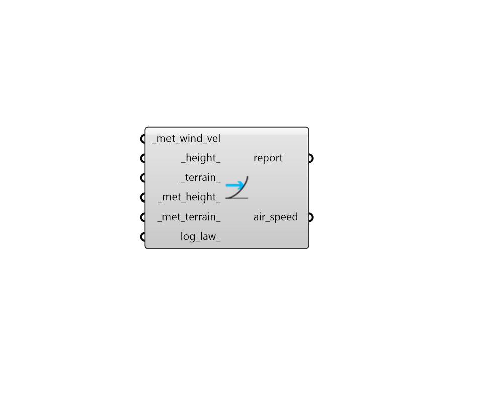

## Wind Speed

 - [[source code]](https://github.com/ladybug-tools/ladybug-grasshopper/blob/master/ladybug_grasshopper/src//LB%20Wind%20Speed.py)

Calculate wind speed at a specific height above the ground for a given terrain type. 

By default, the component will calculate wind speed at a height of 1 meter, which is suitable for most thermal comfort models like PET and SET. Alternatively, by hooking up the output wind data to the "LB Wind rose" component, a wind rose for any terrain or at height above the ground can be produced. 

This component uses the same wind profile function as used by the "LB Wind Profile" component. 

#### Inputs
* ##### met_wind_vel [Required]
A data collection of meteorological wind speed measured at the _met_height_ with the _met_terrian [m/s]. Typically, this comes from the "LB Import EPW" component. This can also be a number for the meteorological wind speed in m/s. 
* ##### height 
The height above the ground to be evaluated in meters. (Default: 1 meter, which is suitable for most thermal comfort models like PET and SET.). 
* ##### terrain 
Text string that sets the terrain class associated with the output air_speed. This can also be an integer that codes for the terrain. (Default: city). Must be one the following. 
0 = city - 50% of buildings above 21m over a distance of at least 2000m upwind. 1 = suburban - suburbs, wooded areas. 2 = country - open, with scattered objects generally less than 10m high. 3 = water - flat areas downwind of a large water body (max 500m inland). 
* ##### met_height 
A number for the height above the ground at which the meteorological wind speed is measured in meters. (Default: 10 meters, which is the standard used by most airports and EPW files). 
* ##### met_terrain 
Text string that sets the terrain class associated with the meteorological wind speed. This can also be an integer that codes for the terrain. (Default: country, which is typical of most airports where wind measurements are taken). Must be one the following. 
0 = city - 50% of buildings above 21m over a distance of at least 2000m upwind. 1 = suburban - suburbs, wooded areas. 2 = country - open, with scattered objects generally less than 10m high. 3 = water - flat areas downwind of a large water body (max 500m inland). 
* ##### log_law 
A boolean to note whether the wind profile should use a logarithmic law to determine wind speeds instead of the default power law, which is used by EnergyPlus. (Default: False). 

#### Outputs
* ##### report
Reports, errors, warnings, etc. 
* ##### air_speed
A data collection or single value for the air speed at the input _height_ above the ground for the input _terrain_. This can be plugged into thermal comfort models like PET or SET/PMV. Alternatively, by connecting the wind data to the "LB Wind rose" component, a wind rose for the input _terrain_ and _height_ above the ground can be produced. 